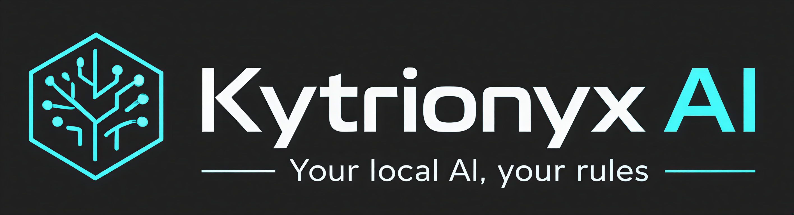

> **Kytrionyx AI** é uma interface web completa e local para interact com modelos de linguagem *open source* via **Ollama**. Um assistente de IA que roda inteiramente no seu hardware, sem enviar dados para servidores externos.

---

## 📋 Índice

- [Sobre](#-sobre-o-projeto)
- [Funcionalidades](#-funcionalidades)
- [Tecnologias](#-tecnologias-utilizadas)
- [Pré-requisitos](#-pré-requisitos)
- [Instalação](#-como-instalar)
- [Como Usar](#-como-usar)
- [Estrutura do Projeto](#-estrutura-de-pastas)
- [Variáveis de Ambiente](#-variáveis-de-ambiente)
- [Arquitetura](#-arquitetura)
- [API Endpoints](#-api-endpoints)
- [Contribuindo](#-como-contribuir)
- [Licença](#-licença)

---

## 📌 Sobre o Projeto

**Kytrionyx AI** é uma solução completa para executar assistentes de IA localmente, oferecendo:

- ✅ **Privacidade Total**: Nenhum dado é enviado para servidores externos
- ✅ **Modelos Open Source**: Suporte para qualquer modelo disponível no Ollama
- ✅ **Interface Web Moderna**: UI responsiva e intuitiva
- ✅ **Persistência de Dados**: Histórico de conversas salvo em banco de dados
- ✅ **Integração GitHub**: Analise código de repositórios GitHub
- ✅ **Busca Web**: Integração com SearXNG para buscar informações online
- ✅ **Análise de Arquivos**: Suporte para PDF, DOCX, TXT e Markdown
- ✅ **Modo Código**: Sessões dedicadas para desenvolvimento com diffs visuais

---

## ✨ Funcionalidades

### Chat e Conversas
- 💬 Chat em tempo real com streaming de respostas (Server-Sent Events)
- 📚 Histórico persistente de conversas no banco de dados
- 📌 Fixar/desafixar conversas importantes
- 🔄 Suporte a múltiplas conversas simultâneas
- 🎯 Sistema de projetos para organizar conversas por contexto

### Modelos e Capacidades
- 🔀 Trocar entre múltiplos modelos do Ollama
- 👁️ Suporte a modelos com visão (análise de imagens)
- 🧠 Suporte a modelos com "thinking" (raciocínio aprofundado)
- ⚙️ Configuração de parâmetros do modelo (temperatura, top-k, etc)

### Código
- 🔧 Modo Código dedicado com sessões persistentes
- 📊 Visualização de diffs entre versões de código
- 🎨 Syntax highlighting para múltiplas linguagens
- 🔗 Integração com sessões de chat

### Integração GitHub
- 🐙 Conectar repositórios públicos e privados (com token)
- 📑 Indexação automática de código do repositório
- 🔍 Análise de código como contexto nas conversas
- 📋 Suporte a múltiplos repositórios simultâneos

### Busca Web
- 🌐 Integração com SearXNG para busca web
- 📄 Contexto web adicionado automaticamente às respostas
- 🔒 Busca privada e descentralizada

### Gerenciamento de Arquivos
- 📤 Upload de arquivos para análise
- 📄 Extração de texto de PDFs
- 📝 Extração de texto de DOCX
- 🎯 Envio de conteúdo extraído para o modelo

### Memória Contextual
- 🧩 Sistema de memória persistente
- 💾 Salvar informações importantes para contexto futuro
- 🎯 Associar memória a conversas específicas

---

## 🛠️ Tecnologias Utilizadas

### Backend
| Tecnologia | Versão | Descrição |
|-----------|--------|-----------|
| **Java** | 17 | Linguagem de programação |
| **Spring Boot** | 3.2.5 | Framework web |
| **Spring WebFlux** | 3.2.5 | WebClient reativo e streaming |
| **Spring Data JPA** | 3.2.5 | ORM e repositórios |
| **PostgreSQL** | 16 | Banco de dados relacional |
| **Apache PDFBox** | 3.0.2 | Extração de texto de PDFs |
| **Apache POI** | 5.2.5 | Extração de texto de DOCX |
| **Lombok** | - | Redução de boilerplate |
| **Project Reactor** | - | Programação reativa |

### Frontend
| Tecnologia | Descrição |
|-----------|-----------|
| **JavaScript (Vanilla)** | Lógica da aplicação |
| **HTML5** | Estrutura da página |
| **CSS3** | Estilos responsivos |
| **Server-Sent Events (SSE)** | Streaming em tempo real |

### Infraestrutura
| Tecnologia | Descrição |
|-----------|-----------|
| **Docker** | Containerização |
| **Docker Compose** | Orquestração de containers |
| **Ollama** | Engine de LLMs locais |
| **SearXNG** | Motor de busca descentralizado |

---

## 📦 Pré-requisitos

### Sistema
- **SO**: Linux, macOS ou Windows (com Docker/WSL2)
- **Docker**: v20.10+
- **Docker Compose**: v2.10+
- **Disco**: Mínimo 10GB (recomendado 20GB+)
- **RAM**: Mínimo 8GB (recomendado 16GB+)

### Para Desenvolvimento Local
- **Java**: 17+
- **Maven**: 3.6+
- **Node.js**: 14+ (opcional, para ferramentas do frontend)

### Configuração do Ollama
- **Ollama**: Instalado e rodando na porta 11434
- **Modelos baixados**: Use `ollama pull <modelo>` para baixar modelos disponíveis

Modelos recomendados:
```bash
ollama pull llama2           # Modelo base rápido
ollama pull llama3.2         # Modelo melhorado
ollama pull neural-chat      # Modelo otimizado para chat
ollama pull mistral          # Modelo rápido e eficiente
```

---

## 🚀 Como Instalar

### 1. Clone o Repositório

```bash
git clone https://github.com/Otavio2704/kytrionyx-ai.git
cd kytrionyx-ai
```

### 2. Certifique-se que o Ollama está rodando

```bash
# Verificar se Ollama está ativo
curl http://localhost:11434/api/tags

# Se não estiver rodando, inicie-o (macOS/Linux com systemd):
systemctl start ollama

# Ou rode em background:
ollama serve
```

### 3. Deploy com Docker Compose

O projeto já inclui um `docker-compose.yml` que configura tudo automaticamente:

```bash
# Inicie todos os serviços
docker-compose up -d

# Verifique o status
docker-compose ps

# Veja os logs
docker-compose logs -f backend
```

**Serviços iniciados:**
- `kytrionyx-backend` (http://localhost:8080)
- `kytrionyx-db` (PostgreSQL na porta 5432)
- `kytrionyx-searxng` (SearXNG na porta 8081)

### 4. Acesse a Interface

Abra no seu navegador:
```
http://localhost:8080
```

### 5. Configure o Primeiro Modelo

1. Clique em **Configurações** (⚙️ no topo)
2. Selecione um modelo disponível no Ollama
3. Comece a conversar!

---

## 💻 Como Usar

### Chat Básico

1. **Nova Conversa**: Clique em "Nova Conversa" na barra lateral
2. **Digite sua mensagem**: Use a caixa de entrada na parte inferior
3. **Envie**: Pressione Enter ou clique no botão enviar
4. Respostas aparecem em tempo real com streaming

### Modo Código

1. Clique no ícone de código {} na barra lateral
2. Inicie uma **nova sessão de código**
3. Peça para o IA gerar código
4. Visualize diffs e propostas de código
5. Aceite ou rejeite as mudanças

### Integração GitHub

**Conectar um Repositório:**
1. Vá em **Projetos** → **Conectar GitHub**
2. Digite `owner/repositorio` (ex: `torvalds/linux`)
3. (Opcional) Forneça um token para repositórios privados
4. Clique em "Conectar"
5. Aguarde a indexação do repositório

**Usar no Chat:**
- Selecione o repositório conectado
- Peça ao IA para analisar o código
- O contexto será automaticamente incluído

### Upload de Arquivos

1. Clique no ícone de anexo 📎
2. Selecione um arquivo (PDF, DOCX, TXT, MD)
3. Máximo 20MB por arquivo
4. O conteúdo será extraído e enviado ao modelo

### Busca Web

1. Ative "Busca Web" nas opções avançadas
2. O IA buscará na internet e incluirá contexto web
3. Respostas serão baseadas em informações atualizadas

### Memória Contextual

1. Clique em **Memória** 🧠 na barra lateral
2. **Adicione** informações importantes
3. Essas informações serão automaticamente incluídas em futuras conversas
4. Útil para contexto persistente personalizado

---

## 📁 Estrutura de Pastas

```
kyron-ai/
│
├── docker-compose.yml                          # Orquestra postgres, backend e searxng
├── .gitignore                                  # Ignora target/, IDE, logs e settings.yml do SearXNG
├── LICENSE                                     # MIT
│
├── searxng-config/
│   └── settings.yml.example                   # Template de configuração do SearXNG (copiar e editar)
│
└── backend/
    ├── Dockerfile                              # Build multi-stage: Maven (build) → JRE (runtime)
    ├── pom.xml                                 # Dependências Maven: Spring Boot, WebFlux, JPA, PDFBox, POI
    │
    └── src/main/
        │
        ├── resources/
        │   ├── application.yml                 # Datasource, Ollama URL, CORS, logging, Actuator
        │   │
        │   └── static/                         # Frontend servido como recurso estático pelo Spring
        │       ├── index.html                  # HTML principal — estrutura de sidebar, modais, painel de código
        │       ├── style.css                   # Design system completo: tokens, dark/light theme, componentes
        │       │
        │       └── modules/                    # JS modular — cada arquivo tem uma responsabilidade única
        │           ├── state.js                # Estado global (conversationId, model, flags), initRefs() e init()
        │           ├── utils.js                # Helpers puros: escapeHtml, formatDate, renderMarkdown, KaTeX, base64
        │           ├── preferences.js          # Tema, cor de ênfase e idioma (leitura/escrita no localStorage)
        │           ├── setup.js                # Configuração do marked.js, toggles da sidebar, colapso
        │           ├── capabilities.js         # Detecta thinking/vision/context do modelo e atualiza a UI
        │           ├── models.js               # Carrega lista de modelos do Ollama, showModelInfo, closeModal
        │           ├── attachments.js          # Upload de arquivos: extração de texto (doc) e base64 (imagem)
        │           ├── streaming.js            # Controle do botão stop, overlay de coding, notificação de código pronto
        │           ├── code-panel.js           # Painel lateral de código: árvore, editor, preview, diff, download
        │           ├── code-completion.js      # Renderização inline do código gerado: iframe preview, editor com syntax highlight
        │           ├── github.js               # Modal e CRUD de repositórios GitHub, ativação de contexto
        │           ├── history.js              # Histórico de conversas: carregar, deletar, pin, renomear, nova conversa
        │           ├── memory.js               # Modal de memórias: listar, adicionar, toggle ativo/inativo, deletar
        │           ├── projects.js             # CRUD de projetos, upload de arquivos de contexto, chat por projeto
        │           ├── chat.js                 # sendMessage(): monta payload, consome SSE, roteia eventos do stream
        │           └── event-listeners.js      # Registra todos os listeners de DOM; setupAllModules() inicializa tudo
        │
        └── java/otavio/kytrionyxai/
            │
            ├── KytrionyxAiApplication.java         # Entry point Spring Boot (@SpringBootApplication)
            │
            ├── chat/                           # Domínio de conversas e mensagens
            │   ├── ChatController.java         # POST /api/chat e /api/chat/new — recebe payload, dispara stream SSE
            │   ├── HistoryController.java      # GET/PATCH/DELETE /api/history — CRUD de conversas e pin
            │   ├── ConversationService.java    # Regras de negócio: criar, deletar, pin (limite 3), renomear, buscar mensagens
            │   ├── Conversation.java           # Entidade JPA: id, title, modelName, pinned, projectId, messages
            │   ├── ConversationDTO.java        # Projeção para API: fromEntity() e fromEntityWithMessages()
            │   ├── ConversationRepository.java # JPA: findAll ordenado, por projectId, busca por título (LIKE)
            │   ├── Message.java                # Entidade JPA: role, content, thinkingEnabled, toOllamaMap()
            │   ├── MessageDTO.java             # Projeção interna de mensagem (id, role, content, createdAt)
            │   └── MessageRepository.java      # JPA: por conversa ordenado, deleteAll por conversa, last N mensagens
            │
            ├── code/                           # Domínio do Modo Código
            │   ├── CodeController.java         # GET sessão, GET arquivo, download individual, download ZIP, DELETE sessão
            │   ├── CodeGenerationService.java  # Parseia blocos ```lang:path do response, cria/atualiza GeneratedFile no banco
            │   ├── CodeSession.java            # Entidade JPA: vincula conversa a uma sessão de código (linguagem, status)
            │   ├── CodeSessionDTO.java         # Projeção da sessão com lista de GeneratedFileDTO
            │   ├── CodeSessionRepository.java  # JPA: findByConversationId
            │   ├── GeneratedFile.java          # Entidade JPA: filePath, fileName, extension, content, previousContent, version
            │   ├── GeneratedFileDTO.java       # Projeção do arquivo gerado
            │   └── GeneratedFileRepository.java # JPA: findBySessionAndPath, deleteByCodeSessionId
            │
            ├── config/                         # Configuração da aplicação
            │   ├── CorsConfig.java             # Libera origens configuradas via CORS_ALLOWED_ORIGINS
            │   └── WebClientConfig.java        # Bean do WebClient com baseUrl do Ollama e buffer de 10 MB
            │
            ├── files/                          # Extração de texto de arquivos
            │   ├── FileController.java         # POST /api/files/extract — recebe MultipartFile, retorna texto
            │   └── FileExtractorService.java   # Switch por extensão: PDFBox (pdf), POI (docx), UTF-8 (txt/md)
            │
            ├── github/                         # Conector GitHub
            │   ├── GitHubController.java       # GET/POST/DELETE repositórios, POST reindex, GET context
            │   ├── GitHubService.java          # Conecta repo, indexa árvore via API GitHub, busca conteúdo base64, buildContext()
            │   ├── GitHubRepo.java             # Entidade JPA: fullName, branch, token, indexStatus, contextIndex (TEXT)
            │   ├── GitHubRepoDTO.java          # Projeção do repositório para a API
            │   └── GitHubRepoStore.java        # JPA: findAllByOrderByCreatedAtDesc, findByFullName
            │
            ├── memory/                         # Memória persistente do usuário
            │   ├── MemoryController.java       # GET/POST/PATCH toggle/PUT/DELETE /api/memories
            │   ├── MemoryService.java          # buildMemorySystemPrompt() — injeta memórias ativas no system prompt
            │   ├── Memory.java                 # Entidade JPA: content, category, active
            │   └── MemoryRepository.java       # JPA: findByActiveTrueOrderByCreatedAtDesc, findAll
            │
            ├── models/                         # Informações e capacidades dos modelos
            │   ├── ModelController.java        # GET /api/models, /api/models/{name}/info e /capabilities
            │   └── ModelCapabilities.java      # DTO: supportsThinking, supportsVision, contextLength, getAcceptedFileTypes()
            │
            ├── ollama/                         # Integração principal com o Ollama
            │   └── OllamaService.java          # streamChat(): monta system prompt em camadas, executa web search,
            │                                   # injeta contexto GitHub/projeto/memória, faz streaming SSE,
            │                                   # detecta thinking tokens, dispara pós-processamento do Modo Código.
            │                                   # listModels(), getModelInfo(), getModelCapabilities().
            │                                   # Web search: SearXNG → DDG HTML → DDG Instant (fallback chain).
            │
            └── project/                        # Projetos com contexto de arquivos
                ├── ProjectController.java      # GET/POST/PUT/DELETE projetos, upload de arquivo, add texto, delete arquivo
                ├── ProjectService.java         # buildProjectContext() — serializa arquivos do projeto no system prompt
                ├── Project.java                # Entidade JPA: name, description, files (OneToMany)
                ├── ProjectDTO.java             # Projeção com lista de ProjectFileDTO
                ├── ProjectFile.java            # Entidade JPA: filename, fileType, content (TEXT)
                ├── ProjectFileRepository.java  # JPA: findByProjectIdOrderByCreatedAtAsc
                └── ProjectRepository.java      # JPA: findAllByOrderByUpdatedAtDesc
```

### Explicação dos Módulos Principais

| Módulo | Responsabilidade |
|--------|------------------|
| **chat/** | Gerenciar conversas, histórico e mensagens |
| **code/** | Sessões de código, geração e diffs |
| **github/** | Conexão, indexação e análise de repositórios |
| **ollama/** | Comunicação com Ollama, streaming de respostas |
| **files/** | Upload, extração de texto (PDF, DOCX) |
| **memory/** | Armazenamento e recuperação de memória contextual |
| **project/** | Agrupamento de conversas por projeto |
| **model/** | Capacidades e configuração de modelos |
| **config/** | Configuração de CORS, WebClient, etc |

---

## ⚙️ Variáveis de Ambiente

### Backend (application.yml)

```yaml
# Servidor
server:
  port: 8080

# Banco de Dados
spring:
  datasource:
    url: jdbc:postgresql://localhost:5432/kytrionyxai
    username: ollama
    password: ollama123
  jpa:
    hibernate:
      ddl-auto: update  # create-drop | validate | update | create

# Ollama
ollama:
  base-url: http://localhost:11434
  # Docker Linux: http://172.17.0.1:11434
  # Docker Mac/Win: http://host.docker.internal:11434

# CORS
cors:
  allowed-origins: http://localhost:3000,http://localhost:8080

# Logging
logging:
  level:
    root: INFO
    otavio.kytrionyxai: DEBUG

# SearXNG
searxng:
  url: http://localhost:8081
```

### Docker Compose (environment)

```yaml
SPRING_DATASOURCE_URL: jdbc:postgresql://postgres:5432/kytrionyxai
SPRING_DATASOURCE_USERNAME: ollama
SPRING_DATASOURCE_PASSWORD: ollama123
OLLAMA_BASE_URL: http://host.docker.internal:11434
CORS_ALLOWED_ORIGINS: http://localhost:3000,http://localhost:8080
SEARXNG_URL: http://searxng:8080
TZ: America/Sao_Paulo
```

### Variáveis Personalizadas

Para **repositórios privados do GitHub**, defina:
```bash
export GITHUB_TOKEN=seu_token_aqui
```

Ou use a interface web para adicionar tokens por repositório.

---

## 🏗️ Arquitetura

### Diagrama de Componentes

```
┌─────────────────────────────────────────────────────────┐
│                    Frontend (Navegador)                  │
│           HTML5 + CSS3 + JavaScript Vanilla              │
└────────────────────┬────────────────────────────────────┘
                     │ HTTP REST + SSE
                     ▼
┌─────────────────────────────────────────────────────────┐
│            Spring Boot 3.2.5 (Backend)                   │
│  ┌─────────────┬──────────────┬─────────────────────┐   │
│  │ Controllers │   Services   │   Repositories      │   │
│  │ (REST API)  │  (Business)  │   (JPA)             │   │
│  └─────────────┴──────────────┴─────────────────────┘   │
└────────┬──────────────┬──────────────┬────────────────────┘
         │              │              │
         ▼              ▼              ▼
    ┌─────────┐  ┌──────────┐  ┌────────────┐
    │ Ollama  │  │GitHub API│  │PostgreSQL  │
    │(Modelos)│  │(Análise) │  │(Histórico) │
    └─────────┘  └──────────┘  └────────────┘
         │
         ▼
    ┌─────────┐
    │ SearXNG │
    │(Busca)  │
    └─────────┘
```

### Fluxo de Chat

```
Usuario          Frontend         Backend          Ollama      DB
   │                 │                │              │          │
   │─ Digite msg ───>│                │              │          │
   │                 │─ POST /api/chat─>              │          │
   │                 │                │─ Prepare ───>│          │
   │                 │<─ SSE Stream ──│<─ Response ──│          │
   │<─ Atualiza UI ──│                │              │          │
   │                 │                │─ Save msg ──────────────>│
   │                 │                │              │          │
```

### Fluxo de Indexação GitHub

```
Usuario      Frontend      Backend       GitHub API      DB
   │             │             │              │          │
   │─ Connect ──>│             │              │          │
   │             │─ POST ──────>              │          │
   │             │<─ Accepted ──│              │          │
   │             │              │             │          │
   │             │    (async)   │──Fetch────>│          │
   │             │              │<─File list ─│          │
   │             │              │──Fetch────>│          │
   │             │              │<─File data ─│          │
   │             │              │             │          │
   │             │              │─ Index, Save ────────>│
   │  [Indexado] │<─Job done ───│             │          │
   │             │              │             │          │
```

---

## 🔗 API Endpoints

### Chat

| Método | Endpoint | Descrição |
|--------|----------|-----------|
| **POST** | `/api/chat` | Enviar mensagem (SSE streaming) |
| **GET** | `/api/history` | Listar conversas |
| **GET** | `/api/history/{id}` | Obter conversa específica |
| **POST** | `/api/history/create` | Criar nova conversa |
| **DELETE** | `/api/history/{id}` | Deletar conversa |
| **POST** | `/api/history/{id}/rename` | Renomear conversa |
| **POST** | `/api/history/{id}/pin` | Fixar/desafixar |

### Código

| Método | Endpoint | Descrição |
|--------|----------|-----------|
| **POST** | `/api/code/generate` | Gerar código (SSE) |
| **POST** | `/api/code/session` | Criar sessão de código |
| **GET** | `/api/code/session/{id}` | Obter sessão |

### GitHub

| Método | Endpoint | Descrição |
|--------|----------|-----------|
| **GET** | `/api/github/repos` | Listar repositórios |
| **POST** | `/api/github/connect` | Conectar repositório |
| **DELETE** | `/api/github/repos/{id}` | Desconectar repositório |
| **GET** | `/api/github/repos/{id}/index` | Status de indexação |

### Arquivos

| Método | Endpoint | Descrição |
|--------|----------|-----------|
| **POST** | `/api/files/upload` | Upload e extração |
| **GET** | `/api/files/{id}` | Obter arquivo |

### Memória

| Método | Endpoint | Descrição |
|--------|----------|-----------|
| **GET** | `/api/memory` | Listar itens de memória |
| **POST** | `/api/memory` | Adicionar à memória |
| **DELETE** | `/api/memory/{id}` | Deletar item |

### Health Check

| Método | Endpoint | Descrição |
|--------|----------|-----------|
| **GET** | `/actuator/health` | Status da aplicação (Docker) |
| **GET** | `/actuator/info` | Informações da aplicação |

---

## 🔧 Desenvolvimento Local

### Setup de Desenvolvimento

```bash
# 1. Clone o repositório
git clone https://github.com/Otavio2704/kytrionyx-ai.git
cd kytrionyx-ai

# 2. Build do Backend
cd backend
mvn clean install

# 3. Execute localmente (sem Docker)
mvn spring-boot:run

# 4. Em outro terminal, certifique-se que Ollama está rodando
ollama serve

# 5. Acesse http://localhost:8080
```

### Estrutura Maven

```
backend/
├── pom.xml                    # Dependências e configurações
├── Dockerfile                 # Imagem Docker
└── src/
    ├── main/
    │   ├── java/              # Código fonte Java
    └── └── resources/          # application.yml + frontend estático
    
```

### Dependências Principais (pom.xml)

```xml
<!-- Spring Boot Framework -->
<spring-boot-starter-web/>         <!-- MVC REST -->
<spring-boot-starter-webflux/>     <!-- WebClient reativo -->
<spring-boot-starter-data-jpa/>    <!-- ORM -->

<!-- Database -->
<postgresql/>                       <!-- Driver JDBC -->
<h2/>                              <!-- Para testes -->

<!-- Utilities -->
<lombok/>                          <!-- Boilerplate elimination -->
<apache-commons/>

<!-- File Processing -->
<pdfbox/>                          <!-- PDF extraction -->
<poi-ooxml/>                       <!-- Office docs -->

<!-- Testing -->
<spring-boot-starter-test/>        <!-- JUnit 5 + Mockito -->
<reactor-test/>                    <!-- Flux/Mono tests -->
```

---

## 📝 Contribuindo

Contribuições são bem-vindas! Por favor, siga estes passos:

### 1. Fork o Repositório

```bash
git clone https://github.com/seu-usuario/kytrionyx-ai.git
cd kytrionyx-ai
```

### 2. Crie uma Branch Feature

```bash
git checkout -b feature/sua-feature
```

### 3. Faça suas Mudanças

- Escreva código limpo e bem documentado
- Siga as convenções do projeto
- Adicione testes se necessário

### 4. Commit e Push

```bash
git add .
git commit -m "feat: adicione sua feature descritiva"
git push origin feature/sua-feature
```

### 5. Abra um Pull Request

Descreva suas mudanças no PR e aguarde revisão.

### Convenções de Commit

Use [Conventional Commits](https://www.conventionalcommits.org/):

```
feat: nova funcionalidade
fix: correção de bug
docs: mudanças na documentação
style: formatação, sem mudanças lógicas
refactor: reftoração de código
test: adição ou atualização de testes
chore: atualizações de dependências
```

---

## 🐛 Troubleshooting

### Ollama não conecta

**Erro**: `Connection refused: localhost:11434`

**Solução**:
```bash
# Verifique se o Ollama está rodando
curl http://localhost:11434/api/tags

# Se não estiver, inicie:
ollama serve

# No Docker, use host.docker.internal em vez de localhost
OLLAMA_BASE_URL=http://host.docker.internal:11434
```

### Banco de dados não conecta

**Erro**: `Connection refused: postgres:5432`

**Solução**:
```bash
# Reinicie os containers
docker-compose down
docker-compose up -d

# Verifique logs do PostgreSQL
docker-compose logs postgres
```

### Frontend não carrega

**Erro**: `404 Not Found` ao acessar `http://localhost:8080`

**Solução**:
```bash
# Confirme que o backend está rodando
curl http://localhost:8080/actuator/health

# Verifique logs do backend
docker-compose logs backend
```

### Problema com CORS

**Erro**: `Access to XMLHttpRequest blocked by CORS policy`

**Solução**: Verifique que `CORS_ALLOWED_ORIGINS` contém sua URL frontend:
```yaml
cors:
  allowed-origins: http://localhost:3000,http://localhost:8080
```

---

## 📊 Performance e Escalabilidade

### Otimizações Implementadas

- ✅ **WebClient Reativo**: Não bloqueia threads durante I/O
- ✅ **Pool de Conexões**: 10 conexões máximas no PostgreSQL
- ✅ **Streaming SSE**: Respostas em tempo real sem buffering
- ✅ **Executor Threads**: Thread pool separada para operações async
- ✅ **Índice GitHub Assíncrono**: Indexação roda em background

### Limites Configurados

```yaml
# Tamanho de arquivos
max-file-size: 20MB
max-request-size: 25MB

# Indexação GitHub
max-files-per-repo: 100
max-total-context: 80,000 caracteres
max-file-size: 50,000 caracteres
```

---

## 📚 Referências e Recursos

### Documentação Oficial
- [Spring Boot 3.2](https://spring.io/projects/spring-boot)
- [Ollama Documentation](https://github.com/ollama/ollama)
- [PostgreSQL 16](https://www.postgresql.org/docs/16/)
- [Docker Compose](https://docs.docker.com/compose/)

### Modelos Ollama Recomendados
- **Rápidos**: `neural-chat`, `mistral`, `orca-mini`
- **Balanced**: `llama3.2`, `neural-chat-7b`
- **Poderosos**: `qwen2-72b`, `llama2-uncensored`
- **Visão**: `llava`, `llama3.2-vision`

---

## 📞 Contato e Suporte

- **Issues**: [GitHub Issues](https://github.com/Otavio2704/kytrionyx-ai/issues)
- **Discussões**: [GitHub Discussions](https://github.com/Otavio2704/kytrionyx-ai/discussions)
- **Email**: Abrir issue no repositório

---

## 📄 Licença

Este projeto é licenciado sob a **Licença MIT** - veja o arquivo [LICENSE](LICENSE) para detalhes.

### MIT License Summary
- ✅ Uso comercial
- ✅ Modificação
- ✅ Distribuição
- ✅ Uso privado
- ❌ Sem garantia
- ❌ Sem responsabilidade legal

---

## 🙏 Agradecimentos

- **Ollama** por fornecer a engine de LLMs local
- **Spring Boot** por o framework web robusto
- **PostgreSQL** por o banco de dados confiável
- **SearXNG** por a busca web descentralizada
- **Comunidade Open Source** por as ferramentas e inspiração

---

**Desenvolvido com ❤️ por [Otavio2704](https://github.com/Otavio2704)**

*Última atualização: 22 de abril de 2026*
